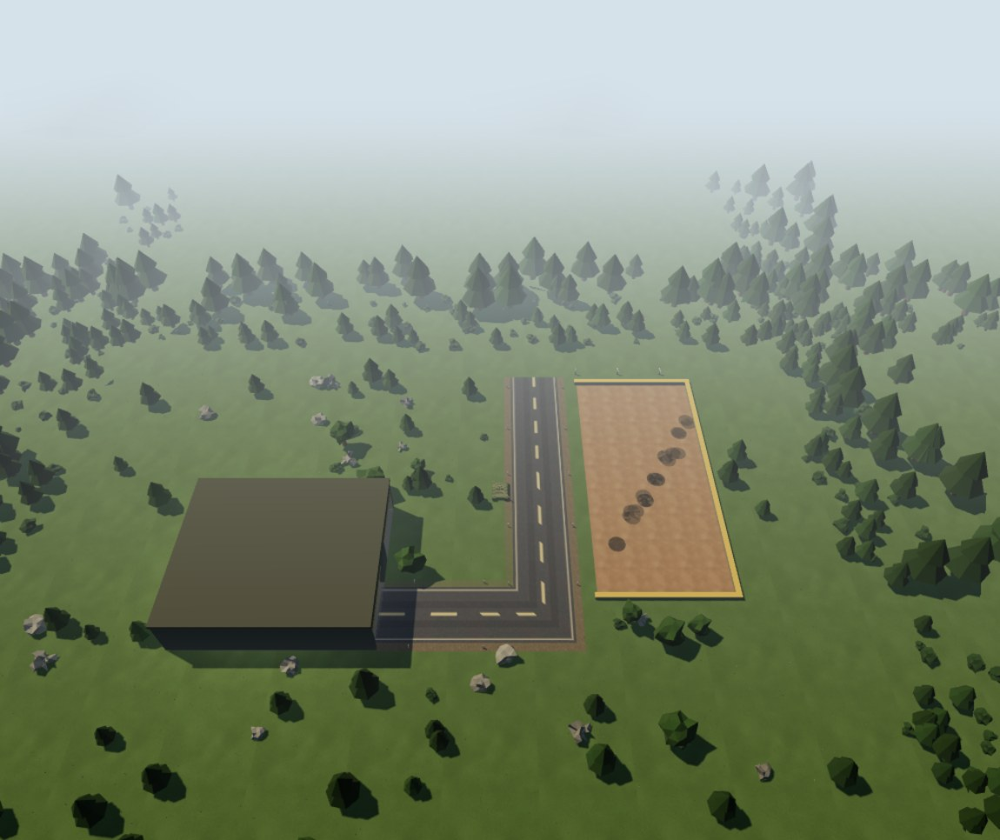
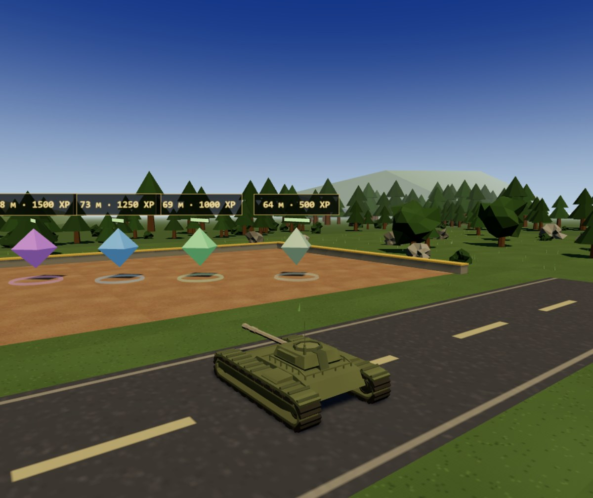

# Резюме: В БОЙ! [WIP]

Интерактивное игровое резюме для отклика на вакансию **Junior Balance Game Designer** в Lesta Games.

Кандидат — танк. Локация — **стрельбище**: старт в гараже, одна дорога на запад и вдоль зоны мишеней
на юг. Секции резюме — цели на линии, выстроенной лестницей дистанций: чем дальше мишень, тем
ценнее секция и тем дороже её уничтожить. Захвати все шесть, и штаб отдаст контакты.
Каждое число в игре обосновано — это и есть портфолио балансера.

**Играть:** https://kerarty.github.io/cv-lesta/ *(после публикации репозитория)* · **Режимы:** «HR» (мягкая помощь прицелу) и «Геймдизайнер» (полностью ручной бой)



---

## Локация: гараж → дорога → мишени

```
z=+60 ┌──────────────────────────────────────────────────────────┐
      │  ▓▓▓▓▓▓▓▓▓▓▓▓▓▓▓▓▓▓▓▓▓▓▓▓▓▓▓▓▓▓▓▓▓▓▓▓▓▓▓▓▓▓▓▓▓▓▓▓▓▓▓▓▓▓▓▓  плотный лес по периметру
      │                       ┌────────────────────────┐
      │  ═════════════════════►│  АНГАР  x 8…44         │  старт: (26, 0), нос на −X
      │                       │  ◄══ выезд 16 м ══════│  ворота по центру: z −8…8
      │                       └────────────────────────┘
      │  ▐ дорога 11 м: осевая штриховка, обочина, столбики-разметчики
      │  ▐
      │ ┌────┴─────────────┐    ▐
      │ │  ЗОНА МИШЕНЕЙ    │    ▐  ← глина + бруствер с трёх сторон
      │ │  x −58…−32      │    ▐     метки дистанции 10/20/30 м от дороги
      │ │   ◆ Образование 64 м · 500 XP
      │ │    ◆ О себе    69 м · 1000 XP
      │ │     ◆ Навыки   73 м · 1250 XP
      │ │      ◆ Проекты 78 м · 1500 XP
      │ │       ◆ Опыт   83 м · 1750 XP
      │ │        ◆ Штаб  88 м · 2500 XP  (патрулирует)
      │ └─────────────────┘    ▐
z=−60 └──────────────────────▐──┴────────────────────────────┘
      x=−75                                               x=+75
```

Разметка взята из плана-эскиза и переведена в метры один в один: жёлтый прямоугольник — вся
локация (150 × 120 м), синие линии — дороги, красный — зона мишеней, чёрный — ангар.
Данные лежат в `BALANCE.map`: уровень влияет на длину сессии, а значит это баланс, а не контент.



**Дорога одна.** Четыре отрезка разрослись в сетку с перекрёстками, которых на полигоне быть не
должно: игрок ехал по пересечению, которого на карте нет. Теперь это одна ломаная — из ангара на
запад и на юг вдоль зоны, полотно 11 м, по краям обочина и столбики-разметчики. Стык на углу
собран митром, поэтому шва на повороте не видно.

**Земля и фон — одно полотно.** Раньше локация и подложка фона были двумя плоскостями разного
цвета, и по краю карты шёл заметный шов. Теперь это один квадрат 700 × 700 с одной текстурой
и тем же масштабом тайла.

**Почему «лестница дистанций».** Мишени стоят на одной линии — но со сдвигом по X, иначе
дистанции от гаража отличались бы на 9 м и связка «ценность растёт с расстоянием» рассыпалась.
Со сдвигом разброс 24 м (64 → 88), и баланс читается: **дороже — значит дальше**.

**Цвет мишени = её цена.** Рампа от серо-зелёного (дёшево) до золотого (штаб = контакты),
легенда — в ангаре. Игрок считывает ценность до выстрела, как на полигоне с индикаторами.

---

## Баланс: ключевые числа

### Орудие
| Параметр | HR | Геймдизайнер | Обоснование |
|---|---|---|---|
| Урон | 250 | 250 | базовая единица всех расчётов |
| Перезарядка | 0.8 с | 1.2 с | «HR не любит ждать»: до 2.0 с было слишком медленно для первого касания |
| Авто-наведение | помощь прицелу: конус 5°, машина не доворачивается | нет | доступность: HR не должен быть «магнитом», иначе режим совпадает с ручным |
| Разворот машины | 63°/с | 63°/с | башня жёстко на корпусе, привода нет — курс задаёт вся машина (A/D и мышь) |
| Скорость снаряда | 60 м/с | 60 м/с | трассер виден, но не бесит |

### Цели (лестница дистанций)
| Секция | HP | Выстрелов | Дистанция от гаража | TTK HR / ГД | XP |
|---|---|---|---|---|---|
| Образование | 250 | 1 | 64 м | 1.07 / 1.07 с | 500 |
| О себе | 500 | 2 | 69 м | 1.07 / 1.47 с | 1000 |
| Навыки | 500 | 2 | 73 м | 1.12 / 1.52 с | 1250 |
| Проекты | 500 | 2 | 78 м | 1.17 / 1.57 с | 1500 |
| Опыт | 500 | 2 | 83 м | 1.22 / 1.62 с | 1750 |
| **Штаб (контакты)** | 750 | 3 | 88 м | 1.28 / 1.68 с | **2500** |

TTK = (выстрелов − 1) × перезарядка + время полёта снаряда. Полёт считается от стрелковой линии
(дорога A, x = −22), где игрок реально стреляет: 16–37 м → 0.27–0.61 с. Цифры — **измеренные
прогоном** (headless-стенд: танк на линии, башня сведена, стрельба до уничтожения), 0 промахов.
От гаража мишени дальше на 48–51 м — это время переезда, а не времени на поражение.

### Математика сессии (измерено)
- Выезд из ангара: ~3.5 с до западной стены, дальше по дороге до стрелковой линии ~10–15 с.
- Бой: 12 выстрелов (1+2+2+2+2+3) ≈ 15 с реальной стрельбы, но с переездами между мишенями —
  **≈ 16–20 с HR / 24–31 с ГД на все шесть** (прогон бота). Пока у башни был свой привод и
  она доворачивалась сама, те же шесть целей занимали 78 с: на каждую уходило время на сведение.
- Чтение карточек 60–90 с — не блокирует игру, идёт на ходу.
- **Итого ≈ 2–3 минуты** — целевой коридор 2–4 мин, заданный аудиторией: HR открывает ссылку между
  двумя откликами.

### Почему XP растёт именно так
XP = ценность секции для нанимающего: контакты дороже опыта, опыт дороже образования.
Порядок XP = порядок на карте (север → юг) и порядок в kill-feed. Игрок «докупает» внимание
к концу сессии, когда внимание HR на исходе.

---

## Два режима — одна карта

Игра — резюме, поэтому её обязаны пройти и те, кто в последний раз держал мышь лет пять назад,
и те, кому интересно прицел в упор. Режим выбирается на старте и меняет ровно две вещи.

| | HR | Геймдизайнер |
|---|---|---|
| Перезарядка | 0.8 с | 1.2 с |
| Помощь прицелу | конус 5° вокруг ствола: если орудие уже сведено рядом с мишенью, выстрел засчитывается в её центр | нет: точка выстрела — честный крест камеры |

Всё остальное у режимов одинаковое: одна карта, одна машина, одни шесть целей, один разворот 63°/с.
Помощь прицелу в HR **не доворачивает машину** — и это главное решение. При конусе захвата ~50°
башня сама находила цель, и режим отличался от ручного только перезарядкой: HR был не помощью,
а «магнитом», а играть в него было нечего. Узкий конус означает, что ориентироваться всё равно
приходится самому, но последний шанс не отнимает промах из-за десяти сантиметров.

Проверяемость: оба режима проходятся ботом от спавна до контактов — HR 16 с, Геймдизайнер 24–31 с
(разброс — бот целится по кресту и промахивается), 12 попаданий из 12 в каждом. Это тот же стенд,
что считает TTK в таблице выше.

---

## Технологии и запуск

- **Three.js r170** (CDN, без сборщика) · ES-модули · низкополигональный процедурный стиль
- Весь контент — `src/config.js`, весь баланс и геометрия уровня — `src/balance.js`:
  тексты и числа меняются без правки движка
- Лес по периметру — 560 деревьев через `InstancedMesh` (7 мешей вместо ~1700 draw call)

Локально: `python dev-server.py` → http://127.0.0.1:8123 (нужен любой HTTP-сервер — ES-модули не работают с file://).

## Структура

```
src/
├── config.js      # контент: тексты секций, контакты, ссылки
├── balance.js     # баланс: статы, XP, режимы, патч-ноты, геометрия локации
├── main3d.js      # игровой цикл, ввод, UI-состояния
├── world3d.js     # арена: небо, свет, дороги, зона мишеней, ангар, лес
├── tank3d.js      # танк: GLB-модель, инерция, разворот, дифференциал
├── camera3d.js    # камера из-за спины с потолком ангара, pointer lock
├── shooting3d.js  # баллистика, попадания, эффекты
├── targets.js     # цели-секции резюме: цвет, ценник «м · XP», патруль штаба
└── effects3d.js   # дым и пыль
```

## Креды и лицензии

- **Three.js** r170 — MIT, подключается с CDN
- **`assets/models/Tank.glb`** — Quaternius, CC0 (в модели нет UV, поэтому камуфляж
  рисуется вершинными цветами прямо в коде)
- Вся остальная графика — сгенерирована кодом: небо-шейдер, канвас-текстуры земли,
  дороги и мишеней, декор
- Шрифт — системный моно, звуков нет
- Код — MIT (см. `LICENSE`)

---

Готов балансить ваши танки. Контакты — в игре, после захвата штаба.